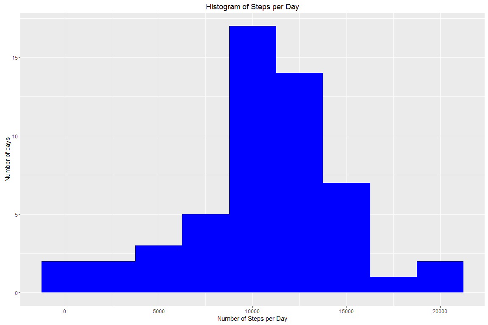
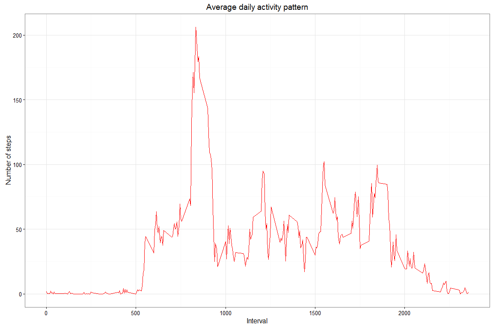
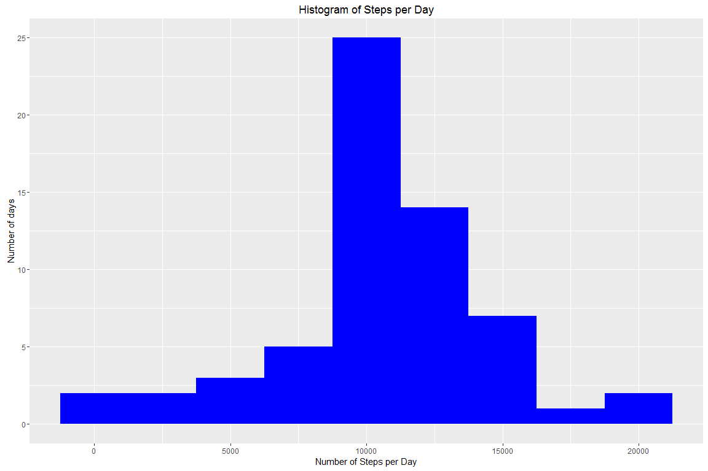
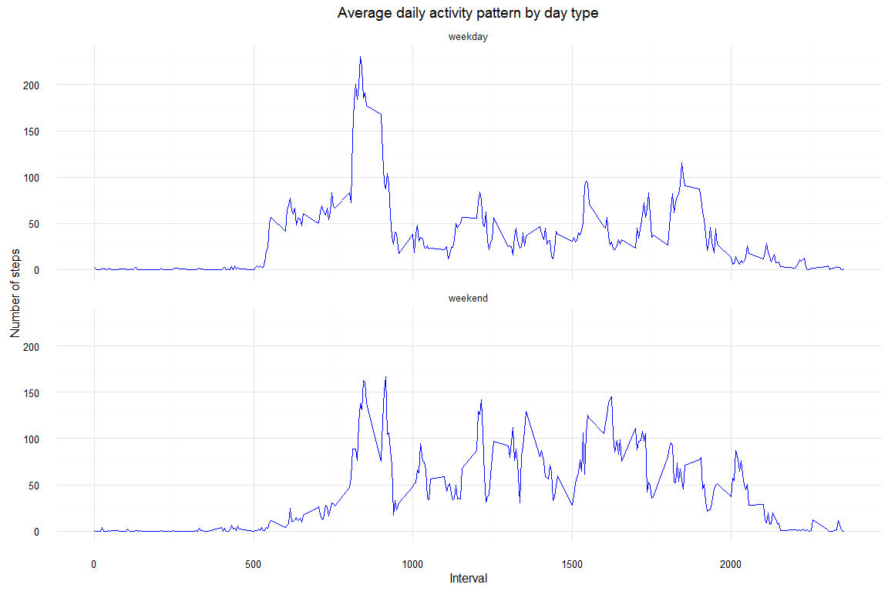

# Reproducible Research: Peer Assessment 1
## Setup the environment
Here we name required libraries and set global parameters


```r
library(knitr)
library(data.table)
library(ggplot2)
library(plyr)
opts_chunk$set(echo = TRUE, results = 'hold', fig.width=12, fig.height=8, fig.path='figure/')
```


## Loading and preprocessing the data


```r
activity <- read.csv('activity.csv', header = TRUE, sep = ",", colClasses=c("numeric", "character", "numeric"))
activity$date <- as.Date(activity$date, format = "%Y-%m-%d")
activity$interval <- as.factor(activity$interval)
head(activity)
```

```
##   steps       date interval
## 1    NA 2012-10-01        0
## 2    NA 2012-10-01        5
## 3    NA 2012-10-01       10
## 4    NA 2012-10-01       15
## 5    NA 2012-10-01       20
## 6    NA 2012-10-01       25
```

## What is mean total number of steps taken per day?
Calculate the total number of steps taken per day, ignoring the missing values in the dataset.


```r
total_steps_per_day = aggregate(steps ~ date, activity, sum)
```

Let's cteate a  histogram of the total number of steps taken per day

```r
ggplot(total_steps_per_day, aes(x = steps)) + 
       geom_histogram(fill = "blue", binwidth = 2500) + 
        labs(title="Histogram of Steps per Day", 
             x = "Number of Steps per Day", y = "Number of days") 
```




Calculations of the mean and median of the total number of steps taken per day


```r
total_steps_mean   <- mean(total_steps_per_day$steps, na.rm=TRUE)
total_steps_median <- median(total_steps_per_day$steps, na.rm=TRUE)
```

The mean is **10766.19**  
The median is **10765.00**

## What is the average daily activity pattern?


```r
av_day <- aggregate(activity$steps, by = list(interval = activity$interval), FUN=mean, na.rm=TRUE)
colnames(av_day) <- c("interval", "steps")
av_day$interval <-    as.integer(levels(av_day$interval)[av_day$interval])
ggplot(av_day, aes(y=av_day$steps, x=av_day$interval)) +  
        geom_line(color="red") +  
        labs(title="Average daily activity pattern", x="Interval", y="Number of steps") + theme_bw()
```



```r
max_interval <- av_day$interval[which.max(av_day$steps)]
```
5-minute interval, on average across all the days in the dataset, contains the maximum number of steps is the interval **835**

## Imputing missing values
Calculation of the total number of missing values in the dataset

```r
  nas <- is.na(activity$steps)
```
 There are **2304** missed values  
 Lets replace missed values with correspondent means
 

```r
nas_index = which(is.na(activity$steps))
activity_filled = activity
na_rep = ddply(activity, .(interval), summarize, steps = mean(steps, na.rm=TRUE))
row.names(na_rep) = na_rep$interval
activity_filled[nas_index,1] = na_rep[as.factor(activity_filled[nas_index,3]),2]
```

Lets make a new histogram and recalculate the mean and  the median


```r
total_steps_per_day_filled = aggregate(steps ~ date, activity_filled, sum)
ggplot(total_steps_per_day_filled, aes(x = steps)) + 
       geom_histogram(fill = "blue", binwidth = 2500) + 
        labs(title="Histogram of Steps per Day", 
             x = "Number of Steps per Day", y = "Number of days") 
```



```r
total_steps_mean_filled   <- mean(total_steps_per_day_filled$steps)
total_steps_median_filled <- median(total_steps_per_day_filled$steps)
```
The new mean is **10766.19**  
The new median is **10766.19**

So, these values differ just a little from the estimates from the first part of the assignment   

## Are there differences in activity patterns between weekdays and weekends?

Lets create day patterns for weekdays and weekends.


```r
activity_filled2 <- activity_filled
activity_filled2$dayType <- as.factor(ifelse(weekdays(activity_filled$date) %in%  c("суббота", "воскресенье"),'weekend','weekday')) 
#Sorry for the russian language
average_summary = aggregate(activity_filled2$steps, list(interval = activity_filled2$interval, dayType = activity_filled2$dayType), mean)
average_summary$interval <-    as.integer(levels(average_summary$interval)[average_summary$interval])
names(average_summary) <- c("interval", "day", "steps")
ggplot(average_summary, aes(interval, steps)) + geom_line(color = "blue") +
facet_wrap(~day, ncol = 1) + labs(title="Average daily activity pattern by day type", x="Interval", y="Number of steps")+theme_minimal()
```



